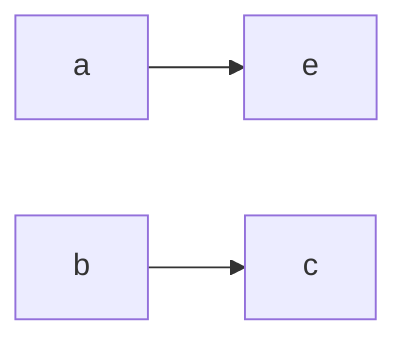

# 密码学相关笔记
最近较为清闲，打算将密码学个人所学过的知识整理一遍，从古典密码到现代密码。希望本文能对密码学的初学者有所帮助，闲话少说了，我尽量只写干货。

## 古典密码
### 单表替换密码
这个加密算法显而易见，仅仅只是使用一个密码本，将一个明文字符替换为另一个密文字符。比如将明文中的a，替换为e,b替换为c。

**明文aabb就会被加密为eecc**。  
但仔细想一下就知道，这种密码的本质只是将一种字符简单替换为另一字符，如果字符存在频率分部不均匀的特点，就可以根据频率特点和单词中经常出现的The，a，an等单词进而破解。不幸的是，英文字母的分布极其不均匀，字母e的出现频率是最高的，像Z,Q，X等字母在英语中的使用频率极低。

其实不光是英语，只要是字符化的人类语言，意大利语，西班牙语都有各自的频率特点，因此使用单表替换密码加密的文本均可使用频率分析的方法进行破解。

### 凯撒密码
这个比较简单，把明文字母表平移几个位置就是密文字母表。例如，密钥为3，解释为将明文平移三个位置,明文A会加密为D，B会会加密为E。具体公式如下：

$E(X)=(X+N) mod 26$

公式中N为密钥，也就是上一段的数字3，mod是取模，X为待加密的明文，解密也是类似，把密文往回倒就可以  
$D(X)=(X-N) mod 26$  

我知道你想说什么，这不就是个变种的单表替换？还是能通过频率破解啊！而且这密钥就26种可能性，试试也能试出来，因此我们引出下一个加密算法**维吉尼亚密码**

### 维吉尼亚密码

如何防止频率破解？将同样的明文加密为不同的密文不就可以了，同样是明文e，有的加密成a，有的加密成b，频率分析就不再适用了。  
维吉尼亚密码可认为是凯撒密码的组合，维吉尼亚密码表如下：  

最上面一行可以认为是要加密的明文字母，最左边一列可以认为是密钥字母（当然，因为维吉尼亚的密码表是行列对称的，行列不是很重要，行列互换结果还是一样）

在加密过程中首先要选择一个单词作为密钥，假设密钥为LEMON，要加密的明文为ATTACAATDAWN，明文第一个字母为A，密钥第一个字母为L，查表可得第A列第L行的密文同样为L。以此类推，加密过程见下图：

明文：ATTACAATDAWN  
密钥：LEMONLEMONLE  
密文：LXFOPLEFRNHR  

特别注意一下，如果密钥长度比明文长需要不断循环密钥单词直到与明文长度一致。现在明文中的A分别被加密为了L,O,E,N，可以有效防止频率破解。这样就无解了吗？非也！由于密钥的重复使用肯定会将同样的明文加密为同样的密文，通过间隔位置猜测密钥长度，再根据密钥长度分解为多个凯撒密码，进而使用频率分析即可破解（不详细赘述了，感兴趣的自己搜）。到这里密码学还依然只是浮于纸上的文字游戏，到二战时的恩格玛机算是把古典密码用机械结构玩到了极致。最后还是被图灵所破解。

## 现代密码
XOR 异或相同为零，不同为1
1 XOR 0 = 1
(现代密码都比较复杂，公式太多-不想整理了，随缘再写吧)

### DES

### AES

### RSA

### ECC椭圆曲线加密

# 致谢
